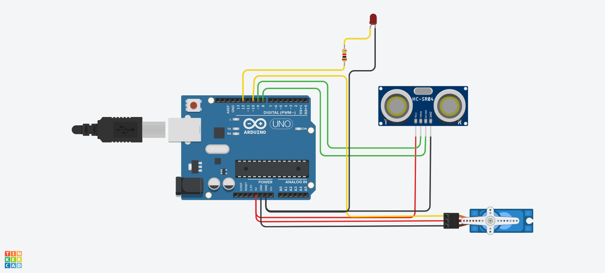

# Ultrasonic Distance Scanner with Servo & LED (Arduino & Tinkercad)

An Arduino-based simulation built in Tinkercad that detects nearby obstacles using an HC-SR04 ultrasonic sensor, triggers an LED alert, and rotates a servo motor to scan the area.

### Project Overview
1. **Clear Path (> 10 cm):** The servo stays centered at **90°**, and the alert LED remains **OFF**.
2. **Obstacle Detected (≤ 10 cm):** The LED turns **ON**, and the servo rotates (**0° -> 180° -> 90°**) to avoid the obstacle.

### Tinkercad Simulation
View and interact with the simulation: [Tinkercad Project Link](https://www.tinkercad.com)

### Pinout Configuration
- **Ultrasonic (HC-SR04):** Trig -> Pin 9 | Echo -> Pin 8
- **Servo Motor:** Signal -> Pin 10
- **Alert LED:** Anode (+) -> Pin 12 (via resistor)
- **Power:** 5V & GND

### Circuit Layout

### Demo Video

