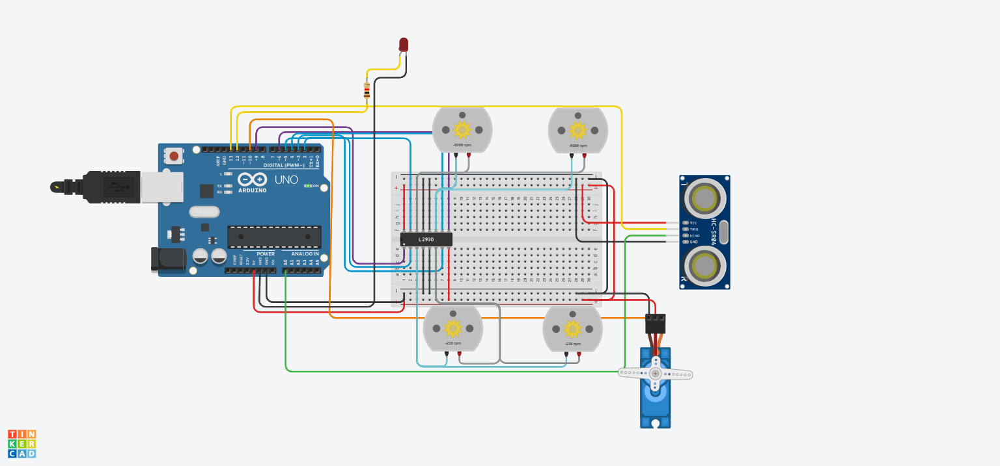

# 4-Wheel Drive Obstacle Avoiding Robot with Ultrasonic, Servo & LED (Arduino & L293D)
An Arduino-based smart obstacle-avoidance robot simulation built in Tinkercad. It drives 4 DC motors using the L293D motor driver IC, monitors the forward path with an HC-SR04 ultrasonic distance sensor, uses a micro servo motor for directional scanning, and indicates obstacle detection using an alert LED.
### Project Overview
- **Clear Path (> 10 cm):** 
  - All 4 DC motors drive forward continuously.
  - The servo motor remains centered at 90° (facing forward).
  - The alert LED stays OFF.
- **Obstacle Detected (≤ 10 cm):**
  - **Alert & Stop:** The LED turns ON and all DC motors halt immediately.
  - **Area Scanning:** The servo sweeps right (0°) and left (180°) to scan the path, then centers back to 90°.
  - **Evasion Maneuver:** The robot reverses briefly, turns to avoid the obstacle, and turns the LED OFF once resuming normal forward movement.
### Tinkercad Simulation
View and interact with the circuit: [Tinkercad Project Link](https://www.tinkercad.com/things/jFrINukYxsu-ultrasonic?sharecode=Ki0RH2CPLSSb4cDT7z0tzLQ4W3j1nMASZKLrOSeqeOo)
### Pinout Configuration

- **L293D Motor Driver (Left Motors):**
  - Pin 1 (Enable 1,2) -> Arduino Pin 9 (PWM)
  - Pin 2 (Input 1) -> Arduino Pin 2
  - Pin 7 (Input 2) -> Arduino Pin 3
  - Pins 3 & 6 (Outputs 1 & 2) -> 2 Left DC Motors 

- **L293D Motor Driver (Right Motors):**
  - Pin 9 (Enable 3,4) -> Arduino Pin 6 (PWM)
  - Pin 10 (Input 3) -> Arduino Pin 4
  - Pin 15 (Input 4) -> Arduino Pin 5
  - Pins 11 & 14 (Outputs 3 & 4) -> 2 Right DC Motors 

- **L293D Power & Ground:**
  - Pin 16 (VCC1 - Logic) -> 5V
  - Pin 8 (VCC2 - Motors) -> 5V
  - Pins 4, 5, 12, 13 (GND) -> Common Ground (GND)

- **HC-SR04 Ultrasonic Distance Sensor:**
  - Trig -> Arduino Pin 13
  - Echo -> Arduino Pin A0
  - VCC -> 5V
  - GND -> GND

- **Micro Servo Motor:**
  - Signal -> Arduino Pin 10
  - Power -> 5V
  - Ground -> GND

- **Alert LED Indicator:**
  - Anode -> Arduino Pin 12
  - Cathode -> GND

### Circuit Layout

### Demo Video

